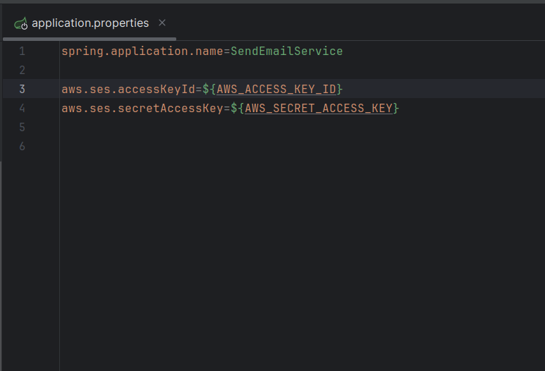
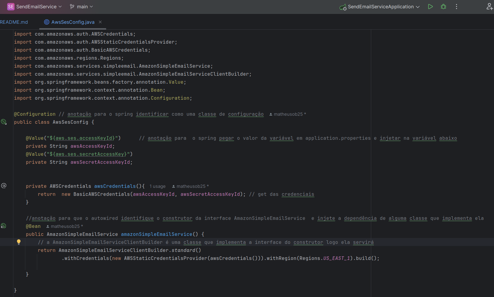
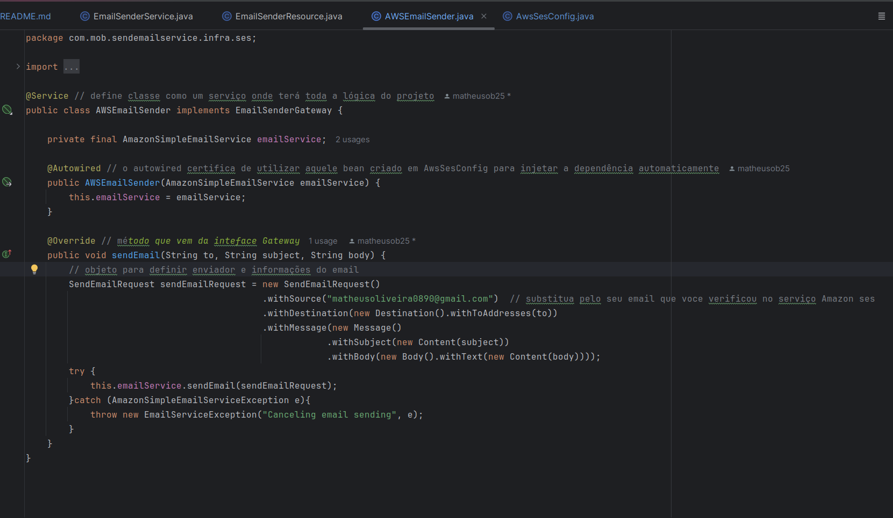
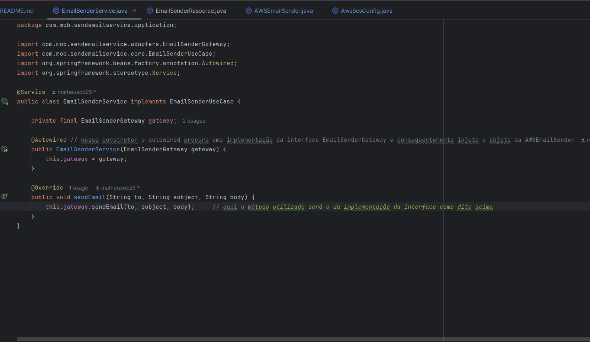
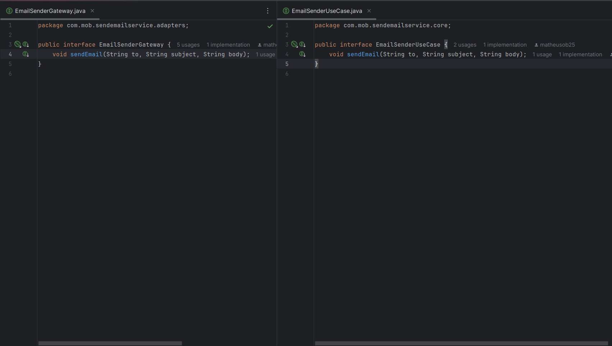
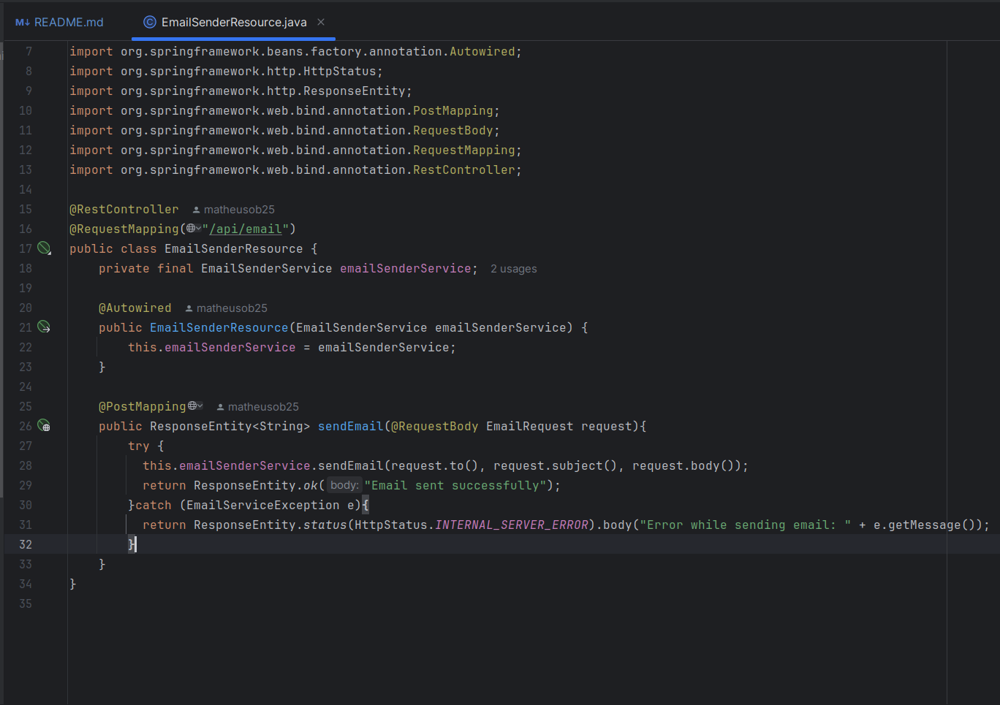
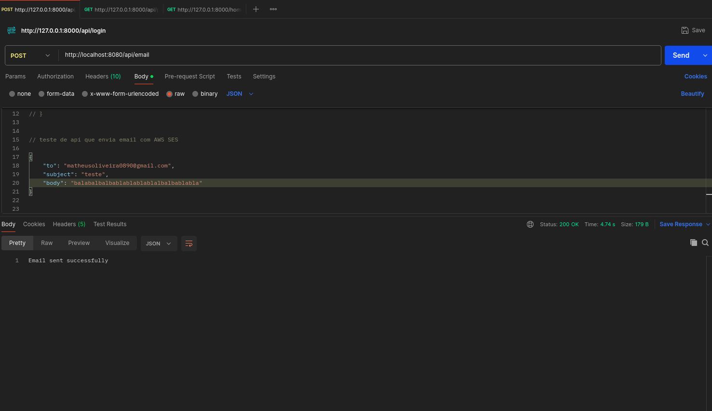

# Serviço de API RestFul que manda requisições POST de envio de emails.

## Configurações para rodar o serviço
Para IDE eu recomendo o intellij, é o mais prático para uso, mas também é possível configurar no eclipse com STS. Nesse projeto eu utilizei o java na versão 17, o spring boot 3.3.4 e o maven de gerenciador de dependências. Recomendo que siga as versões do java e do spring para que o projeto funcione, caso eu atualize eu mudarei as versões no readme também.

- ### Dependências
  - Spring web: Para construir aplicações web e RESTFUL usando o spring MVC.
  - Spring Boot DevTools: Serve para quando realizarmos mudanças no código e ele automaticamente subirá o servidor automaticamente, facilitando o desenvolvimento e teste da aplicação.
  - Amazon SDK Ses: Biblioteca que nos permitirá comunicar com o serviço Amazon Ses e enviar os emails
  - Lombok (Opcional): Acelera o desenvolvimento criando anotações que proveem métodos construtores, getters e setters, equals e hashCodes, etc. Isso ajuda a reduzir o código boilerplate.
  
- ### Arquivo de configuração

Esse arquivo é bem simples e contém apenas as chaves de acesso e chave secreta que devem ser criadas no usuário IAM no console da Aws. Eu coloco o valor dessas variáveis ao rodar o projeto pelo terminal com esse comando: 
$ AWS_ACCESS_KEY_ID=valorDaSuaChaveDeAcesso  AWS_SECRET_ACCESS_KEY=valorDaSuaChaveSecreta ./mvnw spring-boot:run

Essa classe é onde eu  pego o valor das variáveis de chaves de acesso que estão na application.properties e instancio uma classe que implementa a interface do método amazonSimpleEmailService

- ### Configurando serviço da Amazon ses

Para esse teste eu apenas cadastrei meu email como uma identitie no SES  e depois criei um usuário no IAM com a política de acesso AmazonSESFullAccess, e dentro do user eu criei as chaves de acesso. Não é a melhor forma de fazer, eu deveria ter feito uma role, mas o user foi uma forma de agilizar o teste.

- ### Explicando a comunicação entre as camadas do projeto

  #### Classe que se comunica com o serviço da Amazon ses e implementa a gateway

    
    Essa é a classe onde a lógica do uso do serviço da aws está inserido, o serviço que irá se comunicar com o controller irá receber os métodos dessa classe para utilização, por conta da injeção de dependência.

  #### Classe de serviço que comunica com controller

    
    Essa classe será a comunicação com o controlador que gera as requisições, e também é a classe que implementa a interface que fica no núcleo da aplicação onde fica a lógica de negócios.
  - #### Interfaces e suas responsabilidades

    
    É nítido que ambas as interfaces são idênticas porém a idéia seria distribuir as responsabilidades, ou seja, a interface EmailSenderUseCase é onde fica a lógica de negócios do serviço, por isso ela fica na camada do núcleo do projeto, já a EmailSenderGateway será implementada por cada classe que vai criar a lógica de envio do email com determinado serviço externo.

  - #### Controller

    
    O controller ou resource é aonde eu vou criar as requisições que utilizam os métodos criados pelos serviços, eu defini o endpoint como /api/email, então se sua aplicação spring boot está rodando na porta default o endpoint completo é http://localhost:8080/api/email 

- ### Testando o envio de emails
Para testar é só rodar o projeto como eu expliquei, pelo terminal com as chaves de acesso e seus valores, ou simplesmente colocar os valores diretamente dentro das variáveis de application.properties ou até na classe AwsSesConfig. Uma vez que o projeto esteja rodando sem erros é só entrar no Postman ou insomnia para criar a requisição POST com os dados e json com o conteúdo e o destinatário do email.
 
- Porta padrão definida pelo tomcat que o spring utiliza + endpoint do controller: http://localhost:8080/api/email
- Para o teste precisaremos de um body em json dessa forma

  {
  "to": "example@gmail.com",
  "subject": "assunto",
  "body": "informação"
  }

